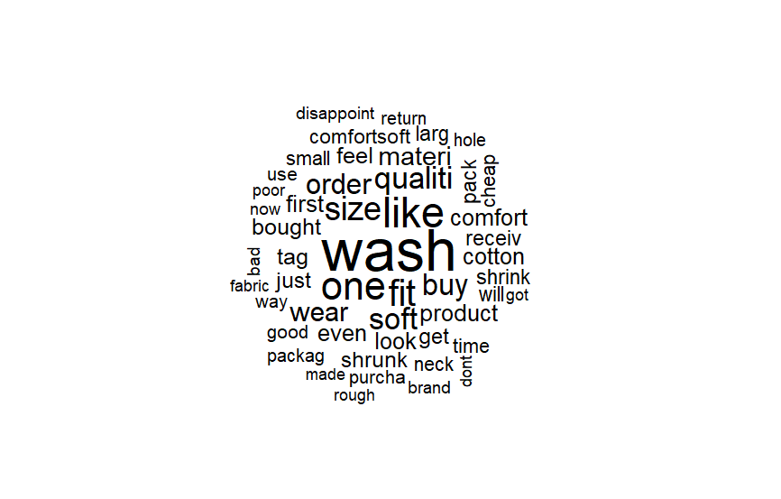

# Análise de comentários de produtos da Amazon

Para exemplificar a utilização do algoritmo de nuvem de palavras proposto no exame de CES-30, fez-se a análise dos comentários 1 estrela (de um total de 5 estrelhas) de três camisas da loja online Amazon.

Links dos produtos:

item1: https://www.amazon.com/product-reviews/B07KCN4G6T/ref=acr_dp_hist_1?ie=UTF8&filterByStar=one_star&reviewerType=all_reviews#reviews-filter-bar  
item2: https://www.amazon.com/product-reviews/B0851JB9TG/ref=acr_dp_hist_1?ie=UTF8&filterByStar=one_star&reviewerType=all_reviews#reviews-filter-bar  
item3: https://www.amazon.com/product-reviews/B07DK5W36Z/ref=acr_dp_hist_1?ie=UTF8&filterByStar=one_star&reviewerType=all_reviews#reviews-filter-bar

Para coleta dos dados, utilizou-se o software ParseHub e a análise foi feita em R.

Resultado da análise:

